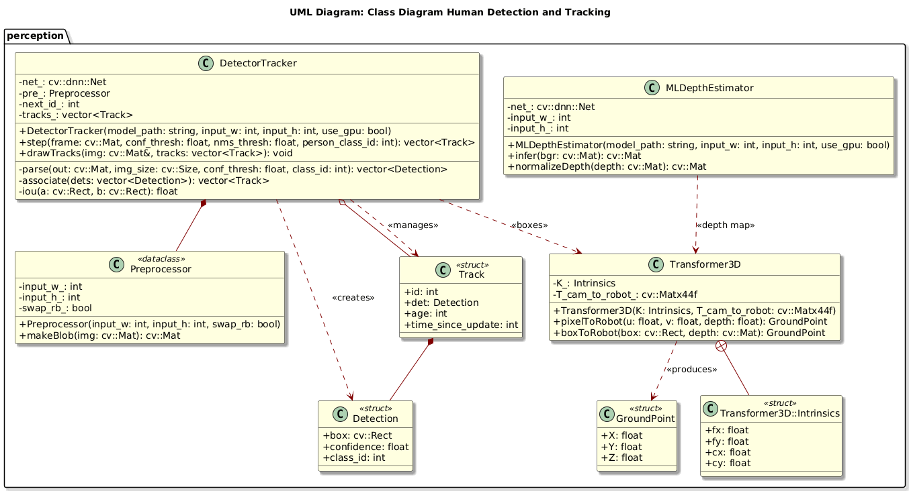
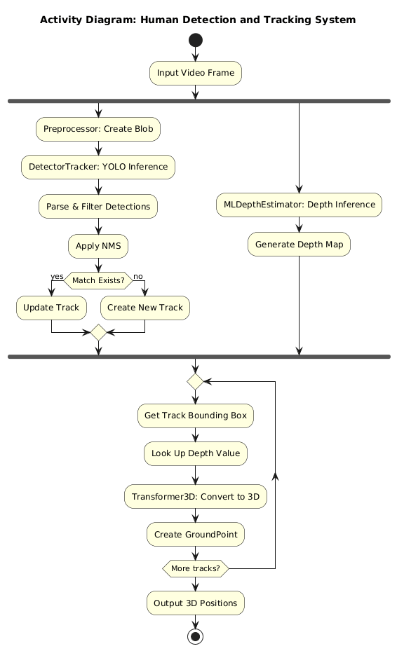

# Human Detector and Tracker

**Module to detect and track humans and return their coordinate position.**

[](https://github.com/shreyak-05/human-detector-and-tracker/actions/workflows/run-unit-test-and-upload-codecov.yml)

[](https://codecov.io/gh/shreyak-05/human-detector-and-tracker)

## Authors
- **Shreya Kalyanaraman** (Driver)
- **Tirth Sadaria** (Navigator)

## Overview

This module provides real-time human detection and tracking for Acme Robotics' autonomous mobile robot platform. Using **YOLOv8 neural networks** and **monocular depth estimation**, the system delivers 3D human positions in robot coordinates for safe navigation.

**Key Features:**
- Real-time human detection with YOLOv8 ONNX models
- Persistent tracking using IoU-based multi-object tracking
- 3D position estimation via monocular depth networks (MiDaS/Depth Anything)
- Direct integration with robot navigation systems


## Project Video

[Watch our 3-minute design presentation](https://youtu.be/bDlo0ityvEo)

## Deliverables

- **Project**: Human(s) obstacle detector and tracker - Output in robot reference frame
- **Overview**: Comprehensive proposal with timeline, risks, and mitigations
- **UML diagrams**: System architecture and component relationships
- **GitHub repository**: Complete codebase with documentation
- **CI/CD setup**: Automated testing and coverage reporting with GitHub Actions
- **Developer documentation**: API reference, integration guides, and Doxygen docs
- **Unit test suite**: GoogleTest framework with 90%+ code coverage target
- **Production-ready C++ module**: CMake integration and cross-platform compatibility

## Potential Risks and Mitigation

- **Depth estimation accuracy in monocular setup**: Validate against known distances, implement confidence scoring, use robust depth networks

- **False and duplicate detection**: Proper NMS implementation, confidence thresholding, temporal consistency checks

- **Integration complexity with existing robot systems**: Design clean interfaces, extensive documentation, modular architecture


## Design

### UML Class Diagram


### Activity Diagram


## Development Process

**Agile Development Process** will be used in the development process with Test-Driven Development.

## Product Backlog
[Initial Product Backlog](docs/_ENPM700-AIP-Mid-term-project-Group3.xlsx)


## Tools and Technologies Used

- **Ubuntu 20.04+ (LTS)**
- **C++17**
- **CMake 3.12+**
- **OpenCV 4.x** (DNN module)
- **GitHub Actions CI**
- **CodeCov** (Coverage reporting)
- **Google Test/Mock** (Unit testing)
- **Doxygen** (Documentation)

## Dependencies with Licenses

| **Dependency** | **Version** | **License** |
|:---------------|:------------|:------------|
| OpenCV | 4.x | Apache 2.0 License |
| GoogleTest | 1.10+ | BSD 3-Clause License |
| CMake | 3.12+ | BSD 3-Clause License |

## Dataset

We are using **YOLO pre-trained models** and **depth estimation networks** trained on standard datasets:
- **YOLO models**: Trained on COCO dataset (person class)
- **Depth networks**: Trained on MiDaS/NYU Depth datasets
- **Test data**: Custom robot environment videos and standard benchmark datasets

## Build Files

### Clone
```bash

git clone git@github.com:shreyak-05/human-detector-and-tracker.git
cd human-detector-and-tracker
```

---

### Build & Test

```bash
cmake -S . -B build -DCMAKE_BUILD_TYPE=Debug -DCMAKE_EXPORT_COMPILE_COMMANDS=ON
cmake --build build

# Run unit tests
./build/test/cpp-check
```

---

### Static Analysis (cppcheck) & Formatting

```bash
# Static analysis (save to results/)
mkdir -p results
cppcheck --enable=all --inline-suppr --error-exitcode=1          --suppress=missingIncludeSystem --suppress=unknownMacro          -I libs/lib1          --std=c++17 --language=c++          --project=build/compile_commands.json          -i build/_deps          2> results/cppcheck.txt

# Formatting
clang-format -i --style=Google $(find . -name *.cpp -o -name *.hpp | grep -v "/build/")
```

---
