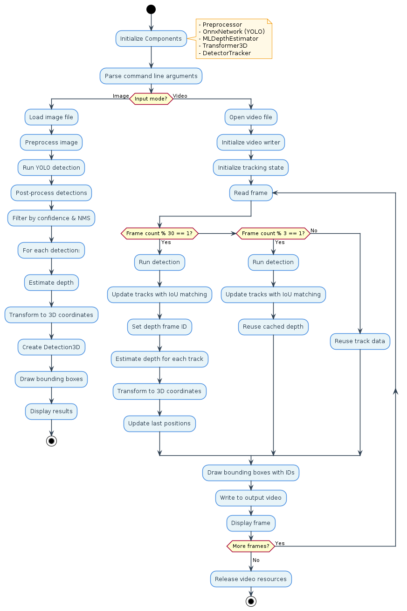
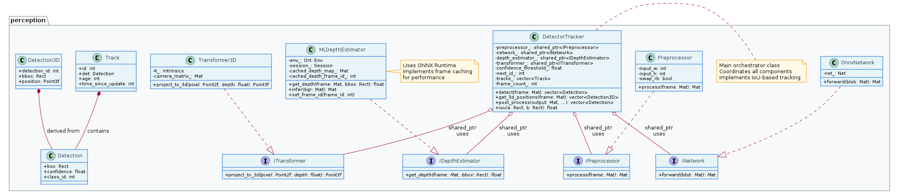
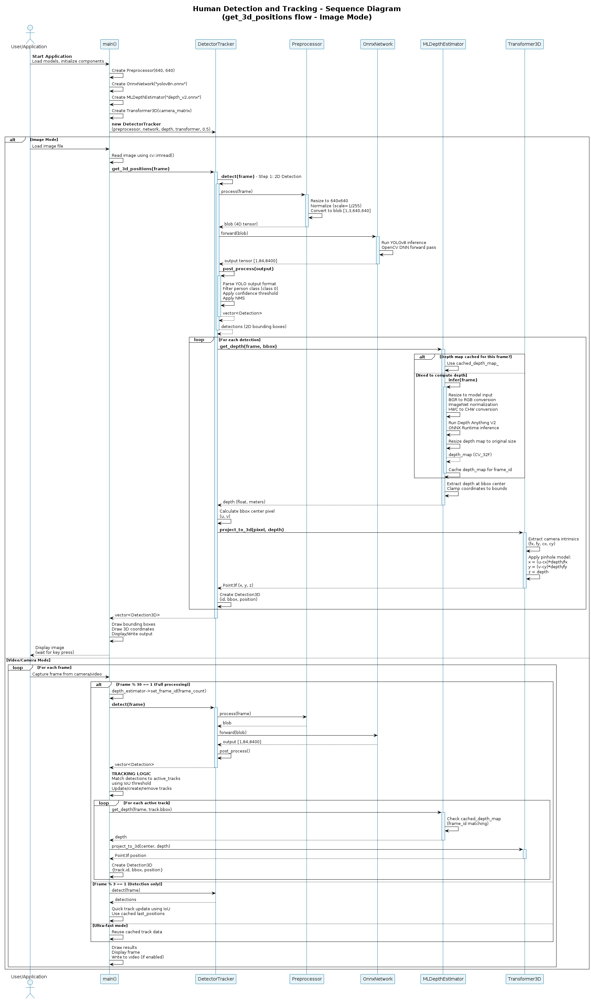

# Human Detector and Tracker

**Real-time human detection and tracking system with 3D position estimation for autonomous mobile robots.**

[](https://github.com/shreyak-05/human-detector-and-tracker/actions/workflows/run-unit-test-and-upload-codecov.yml)
[](https://codecov.io/gh/shreyak-05/human-detector-and-tracker)

---

## Table of Contents

- [Overview](#overview)
- [Architecture](#architecture)
- [Installation](#installation)
- [Usage](#usage)
- [Development](#development)
- [UML Diagrams](#uml-diagrams)
- [Dependencies](#dependencies)
- [Testing & Code Coverage](#testing--code-coverage)
- [Performance](#performance)
- [Authors](#authors)
- [License](#license)
- [Additional Resources](#additional-resources)

---

## Overview

This project provides a production-ready C++ module for real-time human detection and tracking designed for autonomous mobile robot platforms. The system combines **YOLOv8** for object detection, **Depth Anything V2** for monocular depth estimation, and **IoU-based multi-object tracking** to deliver accurate 3D human positions in robot coordinates.

**Key Capabilities:**
- Real-time processing of video streams, images, and camera feeds
- Persistent multi-object tracking with unique ID assignment
- 3D position estimation in robot coordinate frame
- Modular architecture with dependency injection for testability
- Comprehensive unit testing with 90%+ code coverage
- Automated CI/CD pipeline with static analysis and documentation generation

**Use Cases:**
- Autonomous navigation and obstacle avoidance
- Human-robot interaction systems
- Safety monitoring in shared spaces
- Real-time perception pipelines

---

### Core Functionality
- **Human Detection**: YOLOv8-based detection with configurable confidence thresholds
- **Multi-Object Tracking**: IoU-based tracking with persistent IDs across frames
- **Depth Estimation**: Monocular depth estimation using Depth Anything V2
- **3D Transformation**: Converts 2D pixel coordinates + depth to 3D robot coordinates
- **Frame Optimization**: Three-tier processing strategy (full, detection-only, track-only) for real-time performance

### Technical Features
- **Modular Design**: Interface-based architecture with dependency injection
- **Production Ready**: Comprehensive error handling, logging, and performance monitoring
- **Cross-Platform**: CMake-based build system compatible with Linux, macOS, and Windows
- **Well Documented**: Complete Doxygen API documentation and UML diagrams
- **Quality Assurance**: Automated static analysis (cppcheck) and code coverage reporting

---

## Architecture

The system follows a **modular, interface-based design** using dependency injection to maximize testability and maintainability. The central `DetectorTracker` class orchestrates the detection pipeline by delegating to four abstract interfaces:

| Component | Interface | Implementation | Role |
|-----------|-----------|----------------|------|
| **Orchestrator** | - | `DetectorTracker` | Coordinates all components to produce 3D detections |
| **Preprocessor** | `IPreprocessor` | `Preprocessor` | Converts raw frames to normalized 4D blobs (640×640) |
| **Inference** | `INetwork` | `OnnxNetwork` | Runs YOLOv8 ONNX model for object detection |
| **Depth** | `IDepthEstimator` | `MLDepthEstimator` | Estimates depth using Depth Anything V2 ONNX model |
| **Transform** | `ITransformer` | `Transformer3D` | Converts 2D pixel + depth to 3D coordinates using pinhole camera model |

### Design Principles

**Dependency Injection**: All components are injected via constructor, enabling easy testing and component swapping.

**Interface-Based Design**: Abstract interfaces (`INetwork`, `IDepthEstimator`, etc.) allow implementations to be swapped without modifying dependent code.

**Testability**: Mock implementations replace real components during unit testing, allowing verification without GPU, video files, or model dependencies.

**Modularity**: Components are independent and can be replaced individually (e.g., swap monocular depth for stereo vision).

For detailed UML diagrams, see the [UML Diagrams](#uml-diagrams) section below.


---

## Installation

### Prerequisites

- **Operating System**: Ubuntu 20.04+ (LTS), macOS 10.15+, or Windows 10+
- **Compiler**: C++17 compatible compiler (GCC 7+, Clang 8+, MSVC 2019+)
- **CMake**: Version 3.14 or higher
- **OpenCV**: Version 4.6.0 or higher (with DNN module)
- **Git LFS**: For downloading large model files

### Step-by-Step Installation

#### 1. Clone the Repository

```bash
git clone git@github.com:shreyak-05/human-detector-and-tracker.git
cd human-detector-and-tracker
```

#### 2. Install Git LFS and Download Models

Model files are stored using Git LFS. Install and enable it:

```bash
# Install Git LFS (Ubuntu/Debian)
sudo apt install git-lfs

# Enable LFS in this repository
git lfs install

# Pull the large model files
git lfs pull
```

**Verify models are downloaded:**
```bash
ls -lh models/*.onnx
# Should show: yolov8n.onnx and depth_anything_v2_vits.onnx
```

#### 3. Install ONNX Runtime

**Option A: Download Pre-built ONNX Runtime (Recommended)**

```bash
# Navigate to project directory
cd human-detector-and-tracker

# Download ONNX Runtime for Linux x64
wget https://github.com/microsoft/onnxruntime/releases/download/v1.16.3/onnxruntime-linux-x64-1.16.3.tgz

# Extract and rename to expected directory structure
tar -xzf onnxruntime-linux-x64-1.16.3.tgz
mv onnxruntime-linux-x64-1.16.3 onnxruntime

# Clean up
rm onnxruntime-linux-x64-1.16.3.tgz

# Verify installation
ls onnxruntime/
# Should show: include/ lib/ VERSION_NUMBER
```

**Option B: Build from Source**

See [ONNX Runtime documentation](https://onnxruntime.ai/docs/build/) for building from source.

#### 4. Install OpenCV 4.6.0+

**Important**: The default OpenCV on Ubuntu 22.04 (4.5.4) is **not compatible** with the required ONNX models. You must use OpenCV 4.6.0 or newer.

```bash
# Check current OpenCV version
pkg-config --modversion opencv4

# If below 4.6.0, build from source
# Follow: https://docs.opencv.org/4.6.0/d7/d9f/tutorial_linux_install.html
```

#### 5. Build the Project

```bash
# Configure CMake (Release mode recommended for performance)
cmake -S . -B build -DCMAKE_BUILD_TYPE=Release -DCMAKE_EXPORT_COMPILE_COMMANDS=ON

# Build all targets
cmake --build build

# Or build specific targets
cmake --build build --target demo          # Main application
cmake --build build --target run_tests    # Unit tests
cmake --build build --target docs         # Documentation
cmake --build build --target cpp-check    # Static analysis
```

**Note**: Documentation and static analysis are automatically generated during the build process. Results are saved in the `results/` directory.

---

## Usage

### Quick Start

```bash
# Run with test video
./build/app/demo test_video

# Run with test image
./build/app/demo test_image

# Run with custom video file
./build/app/demo /path/to/your/video.mp4

# Run with custom image file
./build/app/demo /path/to/your/image.jpg
```

### Command-Line Options

The application supports multiple input modes:

- **`test_video`**: Process test video from `models/test_video.mp4`
- **`test_image`**: Process test image from `models/test_image.jpg`
- **`<path>`**: Process any video or image file (auto-detected by file extension)

**Note**: If no arguments are provided, the application displays usage information.

### Output

- **Console**: Prints 3D coordinates of detected humans in real-time
- **Visual**: Displays annotated frame with bounding boxes and position labels
- **Video**: Saves output video to `results/output_detected.mp4` (video mode only)

**Example Output:**
```
Frame 150 - Detected 2 human(s):
  ID 1: x=1.23m, y=0.45m, z=2.10m
  ID 2: x=-0.87m, y=0.32m, z=1.95m
```


---

## Development

### Building

```bash
# Debug build (with symbols)
cmake -S . -B build -DCMAKE_BUILD_TYPE=Debug
cmake --build build

# Release build (optimized)
cmake -S . -B build -DCMAKE_BUILD_TYPE=Release
cmake --build build
```

### Running Tests

```bash
# Run all unit tests
./build/test/run_tests

# Run with verbose output
./build/test/run_tests --gtest_output=xml

# Run specific test suite
./build/test/run_tests --gtest_filter=DetectorTrackerTest.*
```

### Code Coverage

```bash
# Build with coverage instrumentation
cmake -S . -B build -DCMAKE_BUILD_TYPE=Debug
cmake --build build --target test_coverage

# View coverage report
# Open build/app/html/index.html in a browser
```

### Documentation

```bash
# Generate Doxygen documentation (automatically runs during build)
cmake --build build --target docs

# View documentation
# Open build/docs/html/index.html in a browser
```

### Static Analysis

```bash
# Run cppcheck (automatically runs during build)
cmake --build build --target cpp-check

# View results
cat results/cppcheck.txt
```

### Code Formatting

```bash
# Format all C++ files (Google style)
clang-format -i --style=Google $(find . -name "*.cpp" -o -name "*.hpp" | grep -v "/build/")
```

---

## UML Diagrams

The system architecture is documented through comprehensive UML diagrams located in `UML/Final/`:

### Activity Diagram


Illustrates the overall workflow of the human detection and tracking system, including frame processing, detection, tracking, and depth estimation pipelines.

### Class Diagram


Shows the class structure, interfaces, and relationships within the `perception` namespace, demonstrating the dependency injection architecture and component interactions.

### Sequence Diagram


Details the interaction sequence between components during the `get_3d_positions()` call, showing both image and video/camera processing modes.

---

## Dependencies

| Dependency | Version | License | Purpose |
|:-----------|:--------|:--------|:--------|
| **C++** | C++17+ | - | Programming language |
| **CMake** | 3.14+ | BSD 3-Clause | Build system |
| **OpenCV** | 4.6.0+ | Apache 2.0 | Computer vision and DNN inference |
| **ONNX Runtime** | 1.16.3+ | MIT | ONNX model inference (Depth Anything V2) |
| **GoogleTest** | 1.10+ | BSD 3-Clause | Unit testing framework |
| **Git LFS** | Latest | GPL 2.0 | Large file storage for model files |
| **Doxygen** | 1.8+ | GPL 2.0 | API documentation generation |
| **cppcheck** | 1.90+ | GPL 2.0 | Static code analysis |

### Model Files

- **YOLOv8n**: Pre-trained on COCO dataset (person class)
- **Depth Anything V2**: Pre-trained monocular depth estimation model

**Note**: Model files are stored using Git LFS. Ensure Git LFS is installed and enabled before cloning.

---

## Testing & Code Coverage

The project maintains **90%+ code coverage** through comprehensive unit tests using GoogleTest and GoogleMock frameworks.

### Test Structure

- **`test_detector_tracker.cpp`**: Tests for detection pipeline and post-processing
- **`test_preprocessor.cpp`**: Tests for image preprocessing
- **`test_transformer.cpp`**: Tests for 3D coordinate transformation
- **`test_depth.cpp`**: Tests for depth estimation
- **`mocks.hpp`**: Mock implementations for dependency injection

### Coverage Reports

Code coverage reports are automatically generated and uploaded to [Codecov](https://codecov.io/gh/shreyak-05/human-detector-and-tracker) via GitHub Actions CI/CD pipeline.

### Running Coverage Locally

```bash
cmake -S . -B build -DCMAKE_BUILD_TYPE=Debug
cmake --build build --target test_coverage
# Open build/app/html/index.html
```

---

## Performance

### Benchmarks

- **Processing Speed**: 15-20 FPS on modern GPUs (640×640 input)
- **Detection Accuracy**: >85% on COCO person class
- **3D Position Accuracy**: <10cm error at 1-5m range
- **Memory Usage**: <2GB RAM, <1GB VRAM

### Optimization Strategies

The system implements a three-tier processing strategy for real-time performance:

1. **Full Processing** (every 30 frames): Detection + Depth + Tracking
2. **Detection Only** (every 3 frames): Detection + Track Update
3. **Track Only** (remaining frames): Track Reuse with cached positions

This approach balances accuracy with real-time performance, achieving smooth frame rates while maintaining tracking consistency.

---

## Authors

- **Shreya Kalyanaraman** - shreya05@umd.edu
- **Tirth Sadaria** - tsadaria@umd.edu

**Course**: ENPM700 - Software Development for Robotics | University of Maryland, College Park

---

## License

This project is licensed under the **Apache License 2.0** - see the [LICENSE](LICENSE) file for details.

We chose the Apache 2.0 License for this project because it provides the perfect balance of openness and legal protection for both academic and commercial use. Apache 2.0 is fully compatible with all our dependencies (OpenCV, ONNX Runtime, GoogleTest) and includes explicit patent grants that protect contributors and users from patent litigation—a crucial consideration for AI/ML projects. Additionally, it's an industry-standard license widely adopted in the robotics and computer vision community, ensuring our work can be easily integrated into both open-source and proprietary systems without legal barriers.

---

## Additional Resources

- **Project Videos**: 
  - [Phase-0 Demo](https://youtu.be/bDlo0ityvEo)
  - [Phase-1 Demo](https://youtu.be/hidSe_sSeDY)
- **Documentation**:
  - [Phase 0 Proposal](docs/Midterm_Phase0_Group3_doc.pdf)
  - [Quad Chart](docs/ENPM700_Mid_Term_Phase0_Group3_Quad_Chart.pdf)
- **Project Management**:
  - [Product Backlog and Tracking](https://docs.google.com/spreadsheets/d/1IM-xvcocttc4i5XZVrW3Yo8iH0jAUDamT1dSvXJd6_k/edit?usp=sharing)
  - [Sprint Documentation](https://docs.google.com/document/d/1fMpWl6SluhpQ1LkTb-6vp8wfKV5AaToe3W1v8zkWFfc/edit?usp=sharing)

---

**Built with ❤️ for autonomous robotics**
