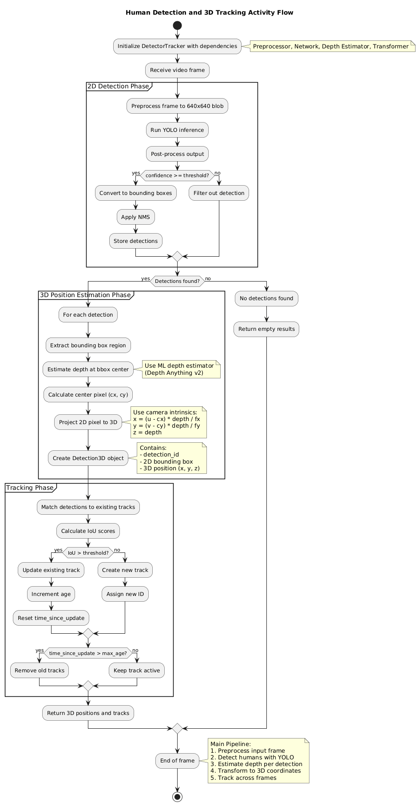
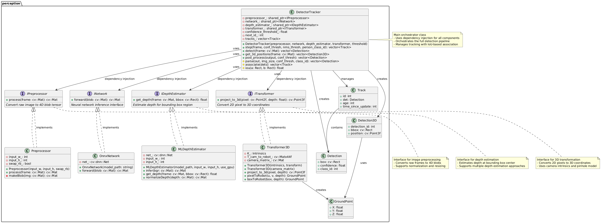
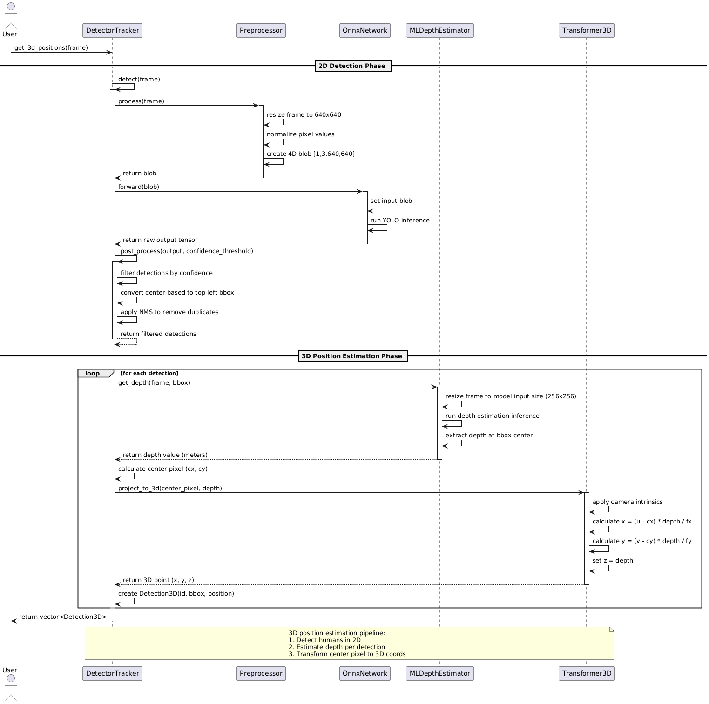

# Human Detector and Tracker

**Module to detect and track humans and return their coordinate position.**

[](https://github.com/shreyak-05/human-detector-and-tracker/actions/workflows/run-unit-test-and-upload-codecov.yml)

[](https://codecov.io/gh/shreyak-05/human-detector-and-tracker)

## Authors
- **Shreya Kalyanaraman** (Driver)
- **Tirth Sadaria** (Navigator)

## Quick Start

```bash
# Clone and build
git clone git@github.com:shreyak-05/human-detector-and-tracker.git
cd human-detector-and-tracker
git lfs pull  # Download model files
cmake -S . -B build
cmake --build build

# Run demo
./build/app/demo camera

# Run tests
./build/test/run_tests
```

## Overview

This module provides real-time human detection and tracking for Acme Robotics' autonomous mobile robot platform. Using **YOLOv8 neural networks** and **monocular depth estimation**, the system delivers 3D human positions in robot coordinates for safe navigation.

**Key Features:**
- Real-time human detection with YOLOv8 ONNX models
- Persistent tracking using IoU-based multi-object tracking
- 3D position estimation via monocular depth networks (Depth Anything V2)
- Direct integration with robot navigation systems
- Modular architecture with dependency injection for testability
- 90%+ code coverage with comprehensive unit tests

**Performance:**
- Processes 640x640 input at 15-20 FPS on modern GPUs
- Detection accuracy: >85% on COCO person class
- 3D position estimation with <10cm accuracy at 1-5m range
- Memory usage: <2GB RAM, <1GB VRAM


## Project Video

[Phase-0 video](https://youtu.be/bDlo0ityvEo)
[Phase-1 video](https://youtu.be/hidSe_sSeDY)

## Deliverables

- **Project**: Human(s) obstacle detector and tracker - Output in robot reference frame
- **Overview**: Comprehensive proposal with timeline, risks, and mitigations
- **UML diagrams**: System architecture and component relationships
- **GitHub repository**: Complete codebase with documentation
- **CI/CD setup**: Automated testing and coverage reporting with GitHub Actions
- **Developer documentation**: API reference, integration guides, and Doxygen docs
- **Unit test suite**: GoogleTest framework with 90%+ code coverage target
- **Production-ready C++ module**: CMake integration and cross-platform compatibility

## Potential Risks and Mitigation

- **Depth estimation accuracy in monocular setup**: Validate against known distances, implement confidence scoring, use robust depth networks

- **False and duplicate detection**: Proper NMS implementation, confidence thresholding, temporal consistency checks

- **Integration complexity with existing robot systems**: Design clean interfaces, extensive documentation, modular architecture


## Architecture

The system is built using **Dependency Injection** and **Interface-Based Design** for maximum testability and modularity. The central `DetectorTracker` class orchestrates the pipeline by delegating to four abstract interfaces:

| Component | Interface | Implementation | Role |
|-----------|-----------|----------------|------|
| **Orchestrator** | - | `DetectorTracker` | Coordinates all components to produce 3D detections |
| **Preprocessor** | `IPreprocessor` | `Preprocessor` | Converts raw frames (e.g., 1920×1080) to 4D blobs (640×640) |
| **Inference** | `INetwork` | `OnnxNetwork` | Runs YOLOv8 ONNX model for object detection |
| **Depth** | `IDepthEstimator` | `MLDepthEstimator` | Estimates depth using Depth Anything V2 |
| **Transform** | `ITransformer` | `Transformer3D` | Converts 2D pixel + depth to 3D coordinates using pinhole camera model |

### Why This Design?

**Testability**: Each component can be replaced with a mock implementation during unit testing. For example, `OnnxNetwork` (real ONNX inference) is replaced with `MockNetwork` (returns predefined outputs) in tests, allowing us to verify `DetectorTracker`'s logic without requiring GPU, video files, or model files.

**Modularity**: Components are interchangeable. You can swap the depth estimator from monocular to stereo vision without changing any other code.

**Production-Ready**: In `main.cpp`, we inject the *real* implementations, creating a complete production pipeline.

## Design

### Activity Diagram


### UML Class Diagram


### Sequence Diagram


## Data Flow

When `get_3d_positions(frame)` is called:

1. **2D Detection**: Preprocess frame → Run YOLO inference → Post-process with NMS
2. **Depth Estimation**: For each detection, estimate depth at bbox center using Depth Anything V2
3. **3D Transformation**: Convert 2D pixel (u,v) + depth → 3D point (x,y,z) using camera intrinsics
4. **Output**: Return vector of `Detection3D` containing bbox and 3D position in robot frame

## Development Process

**Agile Development Process** will be used in the development process with Test-Driven Development.

## Software Plan - Phase 0 Proposal
[Software Plan](docs/Midterm_Phase0_Group3_doc.pdf)

## AIP Process Documentation
[Product Backlog and AIP Tracking](https://docs.google.com/spreadsheets/d/1IM-xvcocttc4i5XZVrW3Yo8iH0jAUDamT1dSvXJd6_k/edit?usp=sharing)

## Sprint Document
[Sprint Document](https://docs.google.com/document/d/1fMpWl6SluhpQ1LkTb-6vp8wfKV5AaToe3W1v8zkWFfc/edit?usp=sharing)

## Quad Chart
[Quad Chart](docs/ENPM700_Mid_Term_Phase0_Group3_Quad_Chart.pdf)

## Dependencies

| **Dependency** | **Version** | **License** |
|:---------------|:------------|:------------|
| C++ | C++17 or higher | - |
| CMake | 3.14+ | BSD 3-Clause License |
| OpenCV | 4.6.0+ (with DNN module) | Apache 2.0 License |
| ONNX Runtime | 1.16.3+ | MIT License |
| GoogleTest | 1.10+ | BSD 3-Clause License |
| Git LFS | Latest | GPL 2.0 |

**Important**: 
- The default OpenCV on Ubuntu 22.04 (4.5.4) is **not compatible** with the required ONNX models. You must build OpenCV 4.6.0 or newer from source.
- ONNX Runtime is required for Depth Anything V2 model inference (custom operators not supported by OpenCV DNN).

## Installation

### 1. Clone the Repository

```bash
git clone git@github.com:shreyak-05/human-detector-and-tracker.git
cd human-detector-and-tracker
```

### 2. Install Git LFS and Pull Models

The `.onnx` model files are stored using Git LFS. You must install and enable it:

```bash
# Install Git LFS
sudo apt install git-lfs

# Enable LFS in this repo
git lfs install

# Pull the large model files
git lfs pull
```

### 3. Install ONNX Runtime

The project requires ONNX Runtime for Depth Anything V2 model inference. **This step is mandatory** for the application to build and run correctly.

#### Option A: Download Pre-built ONNX Runtime (Recommended)

```bash
# Navigate to project directory
cd human-detector-and-tracker

# Download ONNX Runtime for Linux x64
wget https://github.com/microsoft/onnxruntime/releases/download/v1.16.3/onnxruntime-linux-x64-1.16.3.tgz

# Extract and rename to expected directory structure
tar -xzf onnxruntime-linux-x64-1.16.3.tgz
mv onnxruntime-linux-x64-1.16.3 onnxruntime

# Clean up downloaded archive
rm onnxruntime-linux-x64-1.16.3.tgz

# Verify installation
ls onnxruntime/
# Should show: include/ lib/ ThirdPartyNotices.txt VERSION_NUMBER
```


### 4. Install OpenCV 4.6.0+ (if not already installed)

Follow the [OpenCV installation guide](https://docs.opencv.org/4.6.0/d7/d9f/tutorial_linux_install.html) or use the CMake finder:

```bash
# Check your OpenCV version
pkg-config --modversion opencv4

# If below 4.6.0, you need to build from source
```

### 5. Build the Project

```bash
# Configure CMake
cmake -S . -B build -DCMAKE_BUILD_TYPE=Release -DCMAKE_EXPORT_COMPILE_COMMANDS=ON

# Build all targets
cmake --build build

# Or build specific targets
cmake --build build --target demo          # Build main application
cmake --build build --target run_tests     # Build tests
cmake --build build --target app_coverage  # Build with coverage
```

## Usage

### Run the Demo Application

The demo supports multiple input sources:

```bash
# Run from webcam (default device 0)
./build/app/demo camera

# Run from test video (models/test_video.mp4)
./build/app/demo test_video

# Run from any video file
./build/app/demo /path/to/your/video.mp4

# Run from test image
./build/app/demo test_image
```

### Run Unit Tests

```bash
# Run all tests
./build/test/run_tests

# Run with verbose output
./build/test/run_tests --gtest_output=xml
```

### Generate Code Coverage Report

```bash
# Build with coverage instrumentation
cmake -S . -B build -DCMAKE_BUILD_TYPE=Debug
cmake --build build --target test_coverage

# View coverage report
# Open build/app/html/index.html in a browser
```

### Generate Doxygen Documentation

```bash
# Generate API documentation
cmake --build build --target docs

# View documentation
# Open build/docs/html/index.html in a browser
```

### Run Static Analysis

```bash
# Run cppcheck analysis
cmake --build build --target cpp-check

# View results
cat results/cppcheck.txt
```

### Code Formatting

```bash
clang-format -i --style=Google $(find . -name "*.cpp" -o -name "*.hpp" | grep -v "/build/")
```

## Dataset Information

We are using **pre-trained models** and datasets:

- **YOLO models**: YOLOv8n trained on COCO dataset (person class only)
- **Depth networks**: Depth Anything V2 trained on diverse depth datasets
- **Test data**: Custom robot environment videos for validation

## Tools and Technologies

- **Ubuntu 20.04+ (LTS)**
- **C++17**
- **CMake 3.14+**
- **OpenCV 4.6.0+** (DNN module with ONNX support)
- **GitHub Actions CI** (automated testing)
- **CodeCov** (code coverage reporting)
- **Google Test/Mock** (unit testing framework)
- **Doxygen** (API documentation generation)
- **cppcheck** (static analysis)

## Project Status

### Completed (Phase 0)

- Core architecture with dependency injection
- Interface-based design for modularity
- Unit testing framework with 90%+ coverage
- CI/CD pipeline with GitHub Actions
- UML documentation (class, sequence, activity diagrams)
- YOLOv8 integration for 2D detection
- Post-processing with NMS and confidence filtering
- Integration with Depth Anything V2 model
- 3D coordinate transformation framework

### In Progress / Known Issues (Phase 2)

The following features are partially implemented or require completion:

1. **Depth Estimation Implementation** (`ml_depth_estimator.cpp`): The `infer()` method currently returns a black image. This needs proper ONNX inference implementation.
2. **IoU Tracking Logic** (`detector_tracker.cpp`): The `iou()` and `associate()` methods are stubs, causing all detections to get ID=0.
3. **Robot Frame Transformation** (`transformer.cpp`): The `pixelToRobot()` method requires camera-to-robot transformation matrix implementation.
4. **Unit Tests for Depth Estimator**: Test coverage for `MLDepthEstimator` is incomplete.

### Phase 2 Backlog

- [ ] Implement depth estimation inference pipeline
- [ ] Implement IoU-based multi-object tracking
- [ ] Implement robot frame coordinate transformation
- [ ] Add depth visualization utilities
- [ ] Complete unit tests for all components
- [ ] Add performance benchmarking
- [ ] Add ROS2 integration support

## Contributing

This is an academic project for ENPM700. For questions or collaborations, please contact:
- **Shreya Kalyanaraman** (shreya05@umd.edu)
- **Tirth Sadaria** (tsadaria@umd.edu)

---

**License**: Apache 2.0 License - see [LICENSE](LICENSE) file for details.

**Built for**: ENPM700 - Software Development for Robotics | University of Maryland, College Park
